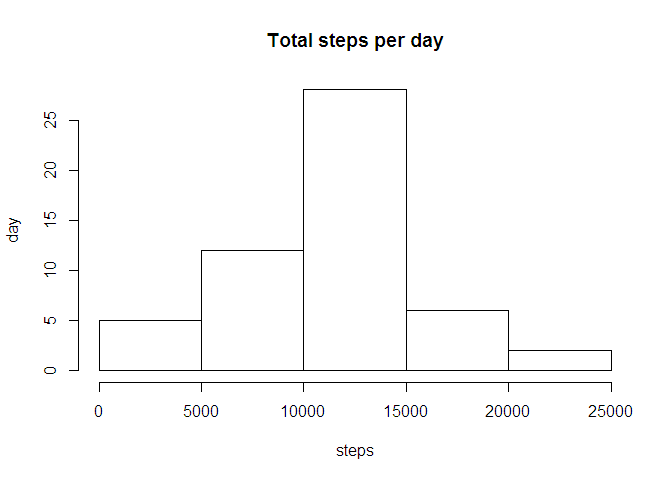
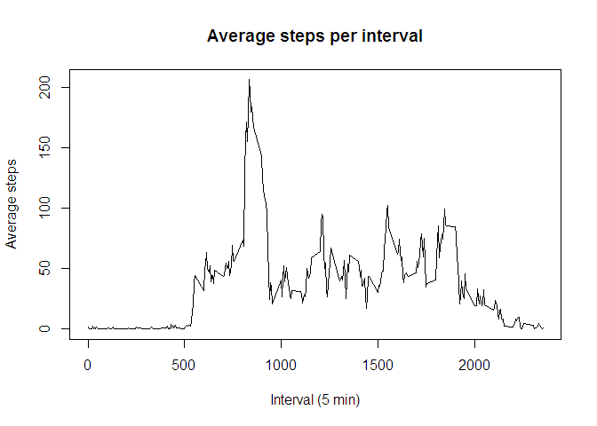
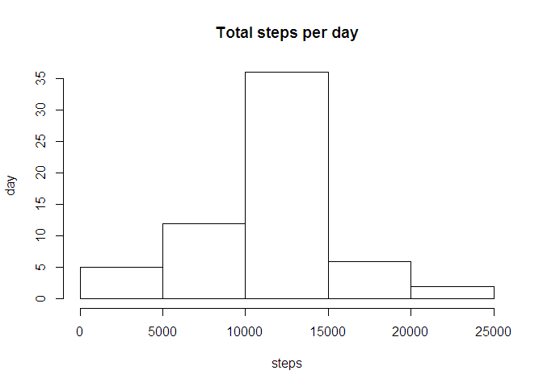
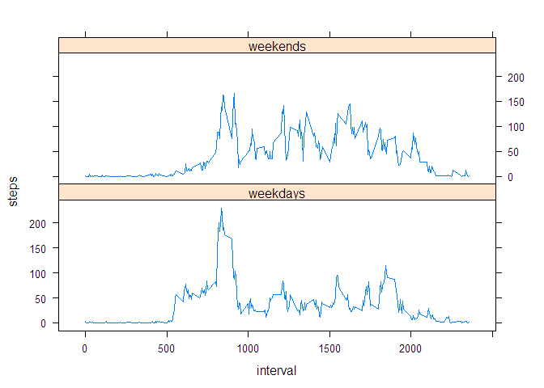

# Reproducible Research: Peer Assessment 1
slk  
-------------------------------------------------------------------------------
## Loading and preprocessing the data
File "activity.zip" must be unzipped and loaded. 


```r
data <- read.csv( unzip( "activity.zip" ) )
```

Once read the data can be tidied as follows
The class of the date column is factor: convert the date column to date


```r
library( lubridate )
data$date <- ymd( data$date )
```

Unique days in the data range from 2012-10-01 through 2012-11-30
by visual inspection.

## What is mean total number of steps taken per day?
Some of the values are NA in the number of steps column
but as per the instructions we may ignore the NA's.

1. Calculate the total number of steps taken per day


```r
df <- data[!is.na( data$steps ),]
steps_by_date <- aggregate( steps ~ date, df, sum )
```

2. Plot a histogram of the total number of steps taken per day


```r
hist( steps_by_date$steps,
     xlab="steps", ylab="day", main="Total steps per day" )
```

 

3. Calculate and report the mean and median of the total number
of steps taken per day


```r
mean( steps_by_date$steps )
```

```
## [1] 10766.19
```

```r
median( steps_by_date$steps )
```

```
## [1] 10765
```

## What is the average daily activity pattern?

Make a time series plot (i.e. type = "l") of the 5-minute interval (x-axis) and the average number of steps taken, averaged across all days (y-axis)


```r
timeseries <- aggregate( steps ~ interval, df, mean )
plot( timeseries$steps ~ timeseries$interval, type='l',
      xlab="Interval (5 min)", ylab="Average steps", 
      main="Average steps per interval" )
```

 

Which 5-minute interval, on average across all the days in the dataset, contains the maximum number of steps?


```r
timeseries$interval[ which.max( timeseries$steps ) ]
```

```
## [1] 835
```

## Imputing missing values
Note that there are a number of days/intervals where there are missing values (coded as NA). The presence of missing days may introduce bias into some calculations or summaries of the data.

Calculate and report the total number of missing values in the dataset (i.e. the total number of rows with NAs)


```r
sum( is.na( data$steps ) )
```

```
## [1] 2304
```

Devise a strategy for filling in all of the missing values in the dataset. The strategy does not need to be sophisticated. For example, you could use the mean/median for that day, or the mean for that 5-minute interval, etc.

Create a new dataset that is equal to the original dataset but with the missing data filled in.


```r
# use the mean for the 5 minute interval to replace a missing data (steps)
fixed_data <- merge( data, timeseries, by = "interval" )
fixed_data$steps <- ifelse( is.na( fixed_data$steps.x ),
                            fixed_data$steps.y, 
                            fixed_data$steps.x )
# Verify for sanity that there are no NA in the steps column
sum( is.na( fixed_data$steps ) )
```

```
## [1] 0
```

Make a histogram of the total number of steps taken each day and Calculate and report the mean and median total number of steps taken per day. Do these values differ from the estimates from the first part of the assignment? What is the impact of imputing missing data on the estimates of the total daily number of steps?


```r
steps_by_day <- aggregate( fixed_data$steps, 
                           by = list( fixed_data$date ),
                           FUN = sum)
colnames(steps_by_day) <- c("day", "steps")
hist( steps_by_day$steps,
     xlab="steps", ylab="day", main="Total steps per day" )
```

 

```r
mean( steps_by_day$steps )
```

```
## [1] 10766.19
```

```r
median( steps_by_day$steps )
```

```
## [1] 10766.19
```

## Are there differences in activity patterns between weekdays and weekends?
For this part the weekdays() function may be of some help here. Use the dataset with the filled-in missing values for this part.

Create a new factor variable in the dataset with two levels - "weekday" and "weekend" indicating whether a given date is a weekday or weekend day.

```r
library( dplyr )
```

```
## 
## Attaching package: 'dplyr'
## 
## The following objects are masked from 'package:lubridate':
## 
##     intersect, setdiff, union
## 
## The following objects are masked from 'package:stats':
## 
##     filter, lag
## 
## The following objects are masked from 'package:base':
## 
##     intersect, setdiff, setequal, union
```

```r
fixed_data <- mutate( fixed_data, weekday = wday( fixed_data$date, label = TRUE ) )
fixed_data$b_weekend <- ifelse( fixed_data$weekday %in% c("Sat", "Sun"), "weekends", "weekdays")
```

Make a panel plot containing a time series plot (i.e. type = "l") of the 5-minute interval (x-axis) and the average number of steps taken, averaged across all weekday days or weekend days (y-axis). See the README file in the GitHub repository to see an example of what this plot should look like using simulated data.


```r
library( lattice )
timeseries2 <- aggregate( fixed_data$steps, 
                         by = list( fixed_data$interval,
                                   fixed_data$b_weekend), 
                         FUN = mean, na.rm = T )
colnames(timeseries2) <- c( "interval", "weekday", "steps" )
xyplot(steps ~ interval | weekday, data = timeseries2,
       layout = c( 1, 2 ),
       type = 'l')
```

 
